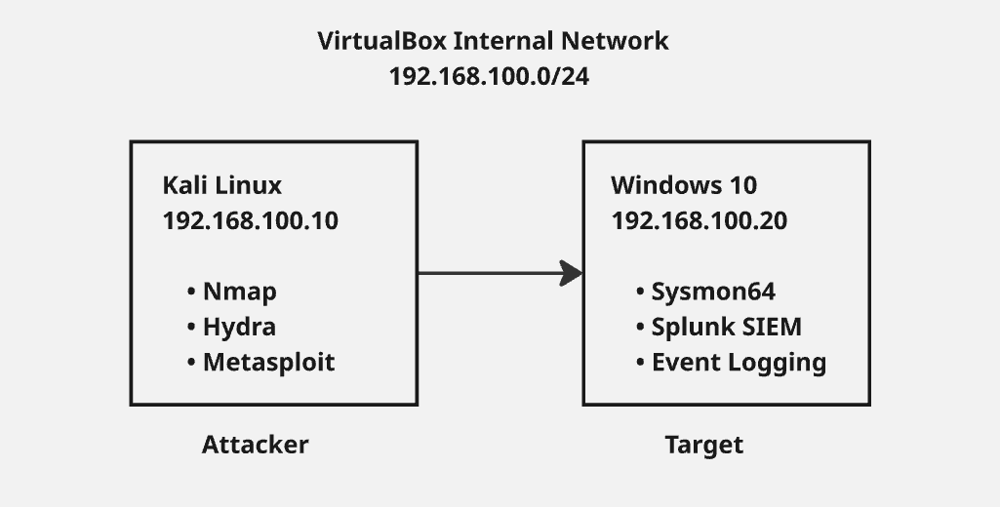
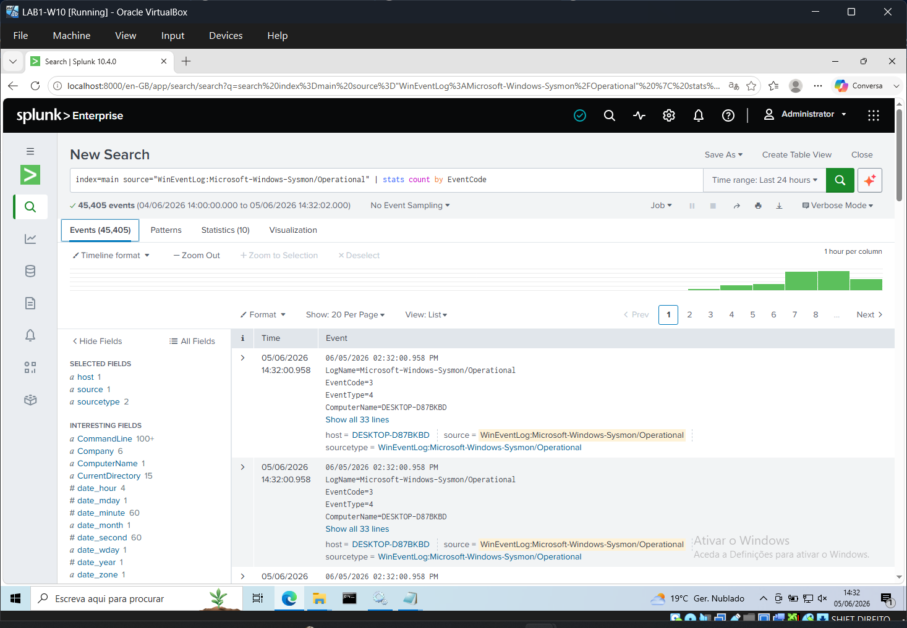
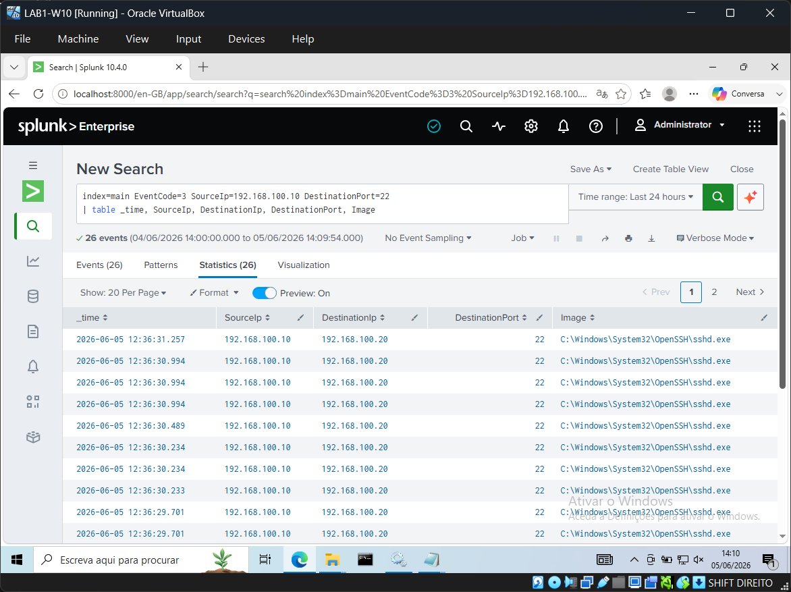
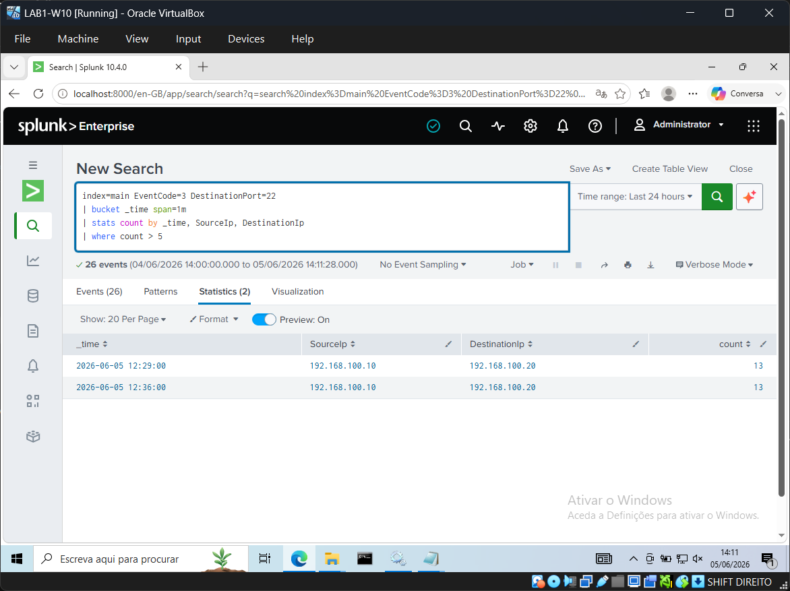

# 🛡️ Home SOC Lab — Beginner's Guide


A home Security Operations Centre (SOC) lab built with VirtualBox, Sysmon, and Splunk. This project simulates a real-world attack and detection cycle — from network reconnaissance to log analysis — using two virtual machines.

---

## Overview

This lab demonstrates a core SOC workflow:

```
Attacker (Kali) → Generates Events → Sysmon Logs → Splunk Indexes → Analyst Investigates
```

**Tools used:**
| Tool | Purpose |
|---|---|
| VirtualBox | Virtualisation platform |
| Kali Linux | Attacker machine |
| Windows 10 | Target / victim machine |
| Sysmon | Endpoint telemetry (Event logging) |
| Splunk Enterprise | SIEM — log collection and analysis |

---

## Architecture



**Network:** VirtualBox Internal Network — traffic is fully isolated from the host machine.

---

## Prerequisites

- Host machine with at least **8GB RAM** (16GB recommended)
- **50GB free disk space**
- [VirtualBox](https://www.virtualbox.org/wiki/Downloads) installed
- [Splunk Enterprise](https://www.splunk.com/en_us/download/splunk-enterprise.html) account (free)

**VM Resource Allocation:**

| VM | RAM | Storage |
|---|---|---|
| Windows 10 | 4096 MB | 50 GB |
| Kali Linux | 2048 MB | 30 GB |

---

## Installation

### 1. VirtualBox Setup

Download and install VirtualBox from [virtualbox.org](https://www.virtualbox.org/wiki/Downloads).

### 2. Virtual Machines

**Windows 10:**
1. Download the Windows 10 ISO from [microsoft.com](https://www.microsoft.com/en-us/software-download/windows10)
2. Create a new VM in VirtualBox and attach the ISO
3. Before starting up, disable internet connection to skip Microsoft Account

**Kali Linux:**
1. Download the VirtualBox image from [kali.org](https://www.kali.org/get-kali/#kali-virtual-machines)
2. Extract with 7-Zip and double-click the `.vbox` file to import
3. Default credentials: `kali` / `kali`

### 3. Network Configuration

Both VMs must be on the same isolated internal network.

**In VirtualBox (for each VM):**
```
Settings → Network → Adapter 1 → Internal Network → Name: "soclab"
```

**Windows 10 — set static IP:**
```
Control Panel → Network → Ethernet → IPv4 Properties
  IP Address:  192.168.100.20
  Subnet Mask: 255.255.255.0
```

**Kali Linux — set static IP:**
```
Right-click network icon → Edit Connections → Double click on your network interface → IPv4 Settings
  Method:  Manual
  Address: 192.168.100.10
  Netmask: 24
```

**Verify connectivity:**
```bash
# From Kali, ping Windows 10
ping 192.168.100.20
```

### 4. Sysmon Installation

Sysmon (System Monitor) provides detailed Windows event logging — far beyond native Windows logs.

**On Windows 10 (PowerShell as Administrator):**

```powershell
# Create directory and download Sysmon
New-Item -ItemType Directory -Path "C:\Sysmon"
Invoke-WebRequest -Uri "https://download.sysinternals.com/files/Sysmon.zip" -OutFile "C:\Sysmon\Sysmon.zip"
Expand-Archive -Path "C:\Sysmon\Sysmon.zip" -DestinationPath "C:\Sysmon"

# Download config (registers all network connections)
notepad C:\Sysmon\sysmonconfig.xml
```

Paste this minimal config optimised for the lab:

```xml
<Sysmon schemaversion="4.90">
  <EventFiltering>
    <RuleGroup name="" groupRelation="or">
      <NetworkConnect onmatch="exclude">
      </NetworkConnect>
    </RuleGroup>
  </EventFiltering>
</Sysmon>
```

```powershell
# Install Sysmon with config
cd C:\Sysmon
.\Sysmon64.exe -accepteula -i sysmonconfig.xml

# Verify
Get-Service Sysmon64
```

**Key Sysmon Event IDs monitored:**

| Event ID | Description | MITRE ATT&CK |
|---|---|---|
| 1 | Process Create | T1059 |
| 3 | Network Connection | T1071 |
| 7 | Image Loaded (DLL) | T1055 |
| 11 | File Created | T1105 |
| 13 | Registry Modified | T1547 |
| 22 | DNS Query | T1071.004 |

### 5. Splunk Installation

1. Download Splunk Enterprise (Windows 64-bit `.msi`) from [splunk.com](https://www.splunk.com/en_us/download/splunk-enterprise.html)
2. Run the installer and set your admin credentials
3. Access Splunk at `http://localhost:8000`

### 6. Connecting Sysmon to Splunk

Create the Splunk input configuration file (PowerShell as Administrator):

```powershell
notepad "C:\Program Files\Splunk\etc\system\local\inputs.conf"
```

Add this content:

```ini
[WinEventLog://Microsoft-Windows-Sysmon/Operational]
index = main
disabled = false
renderXml = false
```

Restart Splunk:

```powershell
cd "C:\Program Files\Splunk\bin"
.\splunk.exe restart
```

**Verify logs are flowing — search in Splunk:**
```
index=main source="WinEventLog:Microsoft-Windows-Sysmon/Operational" | stats count by EventCode
```


---

## Lab Flow

```
┌──────────────┐    ┌──────────────┐    ┌──────────────┐    ┌──────────────┐
│  Kali Linux  │    │  Windows 10  │    │    Sysmon    │    │    Splunk    │
│  (Attacker)  │    │   (Target)   │    │  (Sensor)    │    │    (SIEM)    │
└──────┬───────┘    └──────┬───────┘    └──────┬───────┘    └──────┬───────┘
       │                   │                   │                   │
       │  nmap / hydra     │                   │                   │
       │──────────────────▶│                   │                   │
       │                   │  generates event  │                   │
       │                   │──────────────────▶│                   │
       │                   │                   │  indexes log      │
       │                   │                   │──────────────────▶│
       │                   │                   │                   │
       │                   │                   │         Analyst investigates
```

---

## Attack Simulations

### Network Reconnaissance (Nmap)

```bash
# TCP Connect scan — generates EventID 3 in Sysmon
nmap -sT 192.168.100.20
```

**Detect in Splunk:**
```
index=main EventCode=3 SourceIp=192.168.100.10
| table _time, SourceIp, DestinationIp, DestinationPort, Image
```

### Brute Force Attack (Hydra)

```bash
# SSH brute force
hydra -l administrator -P /usr/share/wordlists/rockyou.txt ssh://192.168.100.20
```

**Detect in Splunk:**
```
index=main EventCode=3 SourceIp=192.168.100.10 DestinationPort=22
| stats count by SourceIp, DestinationPort
```

---

## Detection Examples

### Detecting Port Scans


A port scan generates many network connections in a short time from the same source IP.

```
index=main EventCode=3 SourceIp=192.168.100.10
| bucket _time span=1m
| stats count by _time, SourceIp
| where count > 10
```


---
